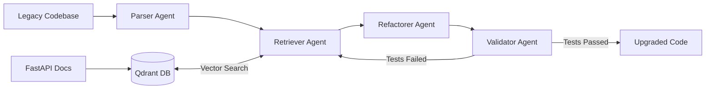

# Autonomous Code Migration & Refactoring Agent

A multi-agent system for automating legacy Python codebase migrations. The target workflow uses **LangGraph** for orchestration and **Qdrant** for retrieval-augmented generation (RAG), refactoring synchronous patterns (e.g., Flask, blocking I/O) into modern async architectures (e.g., FastAPI) with a closed-loop validation step.

**Current focus:** Flask → FastAPI migration for single-file Python services, starting with static AST analysis before wiring LLM and vector search agents.

---

## Project Status

| Component | Status | Location |
|-----------|--------|----------|
| AST parser & anti-pattern detection | **Implemented** | `src/utils/ast_helpers.py`, `src/agents/parser.py` |
| LangGraph shared state schema | **Implemented** | `src/agents/state.py` |
| Retriever agent (Qdrant RAG) | Planned | `src/agents/retriever.py` |
| Refactorer agent (LLM code gen) | Planned | `src/agents/refactorer.py` |
| Validator agent (pytest loop) | Planned | `src/agents/validator.py` |
| Vector store integration | Planned | `src/database/vector_store.py` |
| Pipeline CLI & LangGraph graph | Planned | `run_pipeline.py` |
| Qdrant via Docker Compose | Configured | `docker-compose.yml` |

The parser agent is runnable today. The remaining agents, infrastructure, and end-to-end pipeline are the next milestones.

---

## System Architecture

The pipeline is designed as a cyclic state graph: failed validation feeds errors back into retrieval for self-correction.



### Agent Responsibilities

1. **Parser Agent** *(implemented)* — Walks the legacy source with Python's `ast` module. Detects migration-blocking patterns such as blocking `time.sleep()` calls and legacy Flask imports. Populates `MigrationState.detected_anti_patterns`.
2. **Retriever Agent** *(planned)* — Runs semantic search against a Qdrant vector store seeded with target-framework documentation and migration guides.
3. **Refactorer Agent** *(planned)* — Combines AST metadata and retrieved docs via LLM tool-calling to produce refactored code.
4. **Validator Agent** *(planned)* — Writes candidate code to an isolated directory and runs **pytest**. On failure, passes stack traces back into the graph for another iteration.

---

## Project Structure

```
code-migration-agent/
├── data/
│   └── legacy_codebase/       # Sample legacy Flask app for testing
├── src/
│   ├── agents/
│   │   ├── parser.py          # LangGraph parser node
│   │   ├── retriever.py       # (stub)
│   │   ├── refactorer.py      # (stub)
│   │   ├── validator.py       # (stub)
│   │   └── state.py           # MigrationState TypedDict
│   ├── database/
│   │   └── vector_store.py    # (stub)
│   └── utils/
│       └── ast_helpers.py     # AST analyzer & analyze_source_code()
├── run_pipeline.py            # (stub) CLI entry point
├── docker-compose.yml         # Local Qdrant service
├── .env.example               # Environment variable template
└── requirements.txt           # Python dependencies
```

---

## Getting Started

### Prerequisites

- **Python 3.12+** (3.11+ minimum)
- Docker & Docker Compose *(needed once Qdrant integration lands)*
- OpenAI or Anthropic API key *(needed once refactorer agent lands)*

### 1. Clone and create a virtual environment

```bash
git clone <your-repo-url>
cd code-migration-agent
python3.12 -m venv venv
source venv/bin/activate
```

Run each command separately. `source venv/bin/activate` is a shell command, not an argument to `python -m venv`.

Verify the environment:

```bash
which python      # should point to .../venv/bin/python
python --version
```

### 2. Install dependencies

```bash
pip install --upgrade pip
pip install -r requirements.txt
```

This installs LangGraph, Qdrant client, LLM SDKs, pytest, and related packages for upcoming agents. The parser itself only needs the standard library, but installing deps now avoids rework as the pipeline grows.

### 3. Configure environment variables

```bash
cp .env.example .env
```

Edit `.env` and set your API keys when you reach the refactorer agent. Qdrant defaults (`http://localhost:6333`) match the local Docker service below.

| Variable | Purpose |
|----------|---------|
| `OPENAI_API_KEY` / `ANTHROPIC_API_KEY` | LLM access for code generation |
| `LLM_PROVIDER` | `openai` or `anthropic` |
| `LLM_MODEL` | Model name (e.g. `gpt-4o`) |
| `QDRANT_URL` | Qdrant HTTP endpoint |
| `QDRANT_COLLECTION` | Vector collection for migration docs |
| `MAX_ITERATION_COUNT` | Validator retry limit |

### 4. Verify the parser (available now)

Compile the parser modules:

```bash
python -m py_compile src/utils/ast_helpers.py src/agents/parser.py
```

Run AST analysis against the sample legacy app:

```bash
PYTHONPATH=. python -c "
from src.utils.ast_helpers import analyze_source_code
with open('data/legacy_codebase/app.py') as f:
    result = analyze_source_code(f.read())
for pattern in result['anti_patterns']:
    print(pattern)
"
```

Expected output for `data/legacy_codebase/app.py`:

```
Line 1: Legacy Flask import detected. Consider migrating to FastAPI.
Line 8: Found blocking 'time.sleep()'. Needs migration to 'await asyncio.sleep()'.
```

Exercise the parser LangGraph node directly:

```bash
PYTHONPATH=. python -c "
from src.agents.parser import parser_node
state = {
    'file_path': 'data/legacy_codebase/app.py',
    'legacy_code': open('data/legacy_codebase/app.py').read(),
    'detected_anti_patterns': [],
    'retrieved_docs': [],
    'refactored_code': None,
    'validation_errors': None,
    'iteration_count': 0,
}
result = parser_node(state)
print(result['detected_anti_patterns'])
"
```

### 5. Start Qdrant (optional until retriever lands)

```bash
docker compose up -d
```

Qdrant will be available at `http://localhost:6333`. No API key is required for local development.

### 6. Run the full pipeline *(coming soon)*

Once the remaining agents and LangGraph wiring are in place:

```bash
python run_pipeline.py --input ./data/legacy_codebase/app.py --output ./data/upgraded_codebase/
```

---

## Tech Stack

| Layer | Technology | Status |
|-------|-----------|--------|
| Orchestration | LangGraph | Planned |
| Vector DB | Qdrant | Planned |
| LLM | OpenAI GPT-4o / Anthropic Claude | Planned |
| Static analysis | Python `ast` | **Active** |
| Validation | pytest / subprocess | Planned |
| Infra | Docker Compose | Configured |

---

## Roadmap

### Near term
- [x] Populate `requirements.txt` (LangGraph, qdrant-client, pytest, etc.)
- [x] Add `.env.example` and Qdrant `docker-compose.yml`
- [ ] Wire LangGraph state graph connecting all four agent nodes
- [ ] Implement Qdrant vector store and retriever agent
- [ ] Implement refactorer agent with LLM tool-calling
- [ ] Implement validator agent with pytest closed loop
- [ ] Add `run_pipeline.py` CLI and sample upgraded output

### Later
- [ ] Multi-file dependency mapping (Neo4j GraphRAG)
- [ ] Ragas evaluation for retrieval precision and code faithfulness
- [ ] RBAC tool-gating for CI/CD integration
- [ ] Multi-language AST support (e.g., Java Spring Boot)

---

## Evaluation *(planned)*

When the full pipeline is operational, these benchmarks will track migration quality:

- **Compilation & test pass rate** — Percentage of files that pass the validator loop without manual intervention (target: >88%).
- **Ragas scores** — Context precision (retriever quality) and faithfulness (generated code vs. retrieved docs).

---

## Sample Legacy Code

`data/legacy_codebase/app.py` is a minimal Flask app used to exercise the parser:

```python
import flask
import time

app = flask.Flask(__name__)

@app.route('/')
def index():
    time.sleep(2)
    return "Hello Legacy Flask Code!"
```

This file is the primary test fixture until the end-to-end pipeline is complete.
