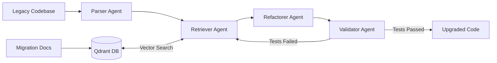

# Autonomous Code Migration & Refactoring Agent

A multi-agent system for automating legacy Python codebase migrations. Uses **LangGraph** for orchestration and **Qdrant** for retrieval-augmented generation (RAG), refactoring synchronous patterns (Flask, blocking I/O) into modern async architectures (FastAPI) with a closed-loop validation step.

**Current focus:** Flask to FastAPI migration for single-file Python services using AST analysis, vector search, and LLM-powered code generation.

---

## Project Status

| Component | Status | Location |
|-----------|--------|----------|
| AST parser & anti-pattern detection | **Implemented** | `src/utils/ast_helpers.py`, `src/agents/parser.py` |
| LangGraph shared state schema | **Implemented** | `src/agents/state.py` |
| Retriever agent (Qdrant RAG) | **Implemented** | `src/agents/retriever.py` |
| Refactorer agent (LLM code gen) | **Implemented** | `src/agents/refactorer.py` |
| Validator agent (syntax check loop) | **Implemented** | `src/agents/validator.py` |
| Vector store integration | **Implemented** | `src/database/vector_store.py` |
| Embedding utility (OpenAI + local fallback) | **Implemented** | `src/utils/embeddings.py` |
| Pipeline CLI & LangGraph graph | **Implemented** | `run_pipeline.py` |
| Knowledge base seeding script | **Implemented** | `seed_docs.py` |

The full pipeline is operational end-to-end.

---

## System Architecture

The pipeline is a cyclic state graph: failed validation feeds errors back into retrieval for self-correction, up to a configurable retry limit.



### Agent Responsibilities

1. **Parser Agent** — Walks the legacy source with Python's `ast` module. Detects migration-blocking patterns and populates `MigrationState.detected_anti_patterns`. Detected patterns include:
   - `import flask` / `from flask import ...` / `from flask import Blueprint`
   - Blocking `time.sleep()` calls
   - Synchronous `requests.get/post/put/delete/patch()` HTTP calls
   - `jsonify()` usage
   - Flask lifecycle hooks (`@app.before_request`, `@app.after_request`, `@app.errorhandler`)
2. **Retriever Agent** — Vectorizes each detected anti-pattern and runs semantic search against the Qdrant vector store to pull relevant migration documentation.
3. **Refactorer Agent** — Combines AST metadata and retrieved docs into a structured prompt, then calls an LLM to produce refactored async code.
4. **Validator Agent** — Writes the candidate code to a temp file and runs `python -m py_compile`. On failure, passes the error trace back into the graph for another refactoring attempt (max 3 iterations).

---

## Project Structure

```
code-migration-agent/
├── data/
│   └── legacy_codebase/
│       └── app.py                 # Sample legacy Flask app
├── src/
│   ├── agents/
│   │   ├── state.py               # MigrationState TypedDict
│   │   ├── parser.py              # AST analysis node
│   │   ├── retriever.py           # Qdrant RAG node
│   │   ├── refactorer.py          # LLM code generation node
│   │   └── validator.py           # Syntax validation node
│   ├── database/
│   │   └── vector_store.py        # Qdrant client wrapper (file-based, no server required)
│   └── utils/
│       ├── ast_helpers.py         # AST analyzer
│       └── embeddings.py          # Embedding utility (OpenAI + local fallback)
├── IMPROVEMENTS.md                # Tracked improvement checklist
├── knowledge_base.json            # Migration rules loaded by seed_docs.py
├── seed_docs.py                   # One-time knowledge base seeding script
├── run_pipeline.py                # CLI entry point
├── docker-compose.yml             # Optional: run Qdrant as a container
├── .env.example                   # Environment variable template
└── requirements.txt               # Python dependencies
```

---

## Getting Started

### Prerequisites

- **Python 3.12+**
- At least one API key: OpenAI or Anthropic (for the refactorer agent)
- No Docker required — Qdrant runs locally via file-based storage

### 1. Clone and create a virtual environment

```bash
git clone <your-repo-url>
cd code-migration-agent
python3.12 -m venv venv
source venv/bin/activate
```

Verify the environment:

```bash
which python      # should point to .../venv/bin/python
python --version
```

### 2. Install dependencies

```bash
pip install --upgrade pip
pip install -r requirements.txt
```

The first run will also download the local embedding model (~90MB) if no OpenAI key is available.

### 3. Configure environment variables

```bash
cp .env.example .env
```

Edit `.env` and fill in your keys:

| Variable | Purpose |
|----------|---------|
| `OPENAI_API_KEY` | OpenAI key for embeddings and code generation |
| `ANTHROPIC_API_KEY` | Anthropic key used as fallback if OpenAI is unavailable |
| `LLM_PROVIDER` | `openai` or `anthropic` |
| `LLM_MODEL` | Model name (e.g. `gpt-4o`) |
| `QDRANT_URL` | `./qdrant_storage` for local file storage, or an HTTP URL for a remote instance |
| `QDRANT_COLLECTION` | Vector collection name (default: `migration_docs`) |
| `MAX_ITERATION_COUNT` | Validator retry limit (default: 3) |

### 4. Seed the knowledge base

Run once before the pipeline. Re-run any time you want to wipe and re-index.

```bash
python seed_docs.py
```

This loads rules from `knowledge_base.json`, embeds them, and upserts them into Qdrant. To add or edit migration rules, edit `knowledge_base.json` directly and re-run this script — no code changes required.

If OpenAI is unavailable or over quota, it automatically falls back to a local `sentence-transformers` model (`all-MiniLM-L6-v2`, 384 dims). The Qdrant collection is created with the correct vector dimensions for whichever provider is used.

To use a different knowledge base file:

```bash
KNOWLEDGE_BASE_PATH=my_rules.json python seed_docs.py
```

### 5. Run the pipeline

```bash
# Print migrated code to stdout
python run_pipeline.py --input data/legacy_codebase/app.py

# Write migrated code to a file
python run_pipeline.py --input data/legacy_codebase/app.py --output data/upgraded_codebase/app.py
```

| Flag | Required | Description |
|------|----------|-------------|
| `--input` | Yes | Path to the legacy Python file to migrate |
| `--output` | No | Path to write the migrated file. Prints to stdout if omitted. |

The pipeline will:
1. Parse the input file for anti-patterns
2. Query Qdrant for relevant migration docs per pattern
3. Call the LLM to produce refactored async code
4. Validate the output compiles cleanly
5. Write the migrated code to `--output`, or print it if no output path is given (halts with error details after 3 failed attempts)

---

## Embedding & LLM Fallback Behavior

Both the embedding step (retriever) and the code generation step (refactorer) are designed to work without a specific API key being available.

| Step | Primary | Fallback |
|------|---------|---------|
| Embeddings | OpenAI `text-embedding-3-small` (1536 dims) | Local `all-MiniLM-L6-v2` (384 dims) |
| Code generation | OpenAI `gpt-4o` | Anthropic `claude-sonnet-4-6` |

**Important:** the embedding provider must be consistent between seeding and querying. If you seed with OpenAI embeddings and later run the pipeline without a working OpenAI key (falling back to local), Qdrant will reject the query due to a vector dimension mismatch. Re-run `seed_docs.py` any time you switch providers.

---

## Tech Stack

| Layer | Technology |
|-------|-----------|
| Orchestration | LangGraph |
| Vector DB | Qdrant (local file storage, no server required) |
| Embeddings | OpenAI `text-embedding-3-small` / `sentence-transformers` |
| LLM | OpenAI GPT-4o / Anthropic Claude Sonnet |
| Static analysis | Python `ast` module |
| Validation | `py_compile` via subprocess |

---

## Roadmap

### Completed
- [x] AST parser with Flask and blocking I/O detection
- [x] LangGraph state graph wiring all four agents
- [x] Qdrant vector store with local file-based storage (no Docker required)
- [x] Retriever agent with semantic search
- [x] Refactorer agent with LLM code generation
- [x] Validator agent with syntax check and retry loop
- [x] OpenAI / local embedding fallback
- [x] OpenAI / Anthropic LLM fallback
- [x] Knowledge base seeding script

### Later
- [ ] Multi-file dependency mapping (Neo4j GraphRAG)
- [ ] Ragas evaluation for retrieval precision and code faithfulness
- [ ] RBAC tool-gating for CI/CD integration
- [ ] Multi-language AST support (e.g., Java Spring Boot)

---

## Evaluation

These benchmarks will track migration quality as the system matures:

- **Compilation & test pass rate** — Percentage of files that pass the validator loop without manual intervention (target: >88%)
- **Ragas scores** — Context precision (retriever quality) and faithfulness (generated code vs. retrieved docs)

---

## Sample Input / Output

**Input** (`data/legacy_codebase/app.py`):

```python
import flask
import time

app = flask.Flask(__name__)

@app.route('/', methods=["GET"])
def index():
    time.sleep(2)
    return "Hello Legacy Flask Code!"

@app.route("/process", methods=["GET"])
def process_data():
    time.sleep(2)
    return "Data Processed Successfully"
```

**Output** (pipeline result):

```python
import asyncio
from fastapi import FastAPI

app = FastAPI()

@app.get("/")
async def index() -> str:
    await asyncio.sleep(2)
    return "Hello Legacy Flask Code!"

@app.get("/process")
async def process_data() -> str:
    await asyncio.sleep(2)
    return "Data Processed Successfully"
```
