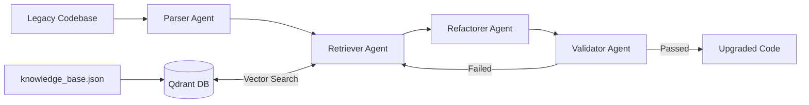

# Autonomous Code Migration & Refactoring Agent

A multi-agent system for automating legacy Python codebase migrations. Uses **LangGraph** for orchestration and **Qdrant** for retrieval-augmented generation (RAG), refactoring synchronous Flask patterns into modern async FastAPI architectures with a closed-loop validation step.

---

## System Architecture

The pipeline is a cyclic state graph: failed validation feeds structured error traces back into retrieval for self-correction, up to a configurable retry limit.



### Agent Responsibilities

1. **Parser Agent** — Walks the legacy source with Python's `ast` module. Detects migration-blocking patterns and populates `MigrationState.detected_anti_patterns`. Detected patterns:
   - `import flask` / `from flask import ...` / `from flask import Blueprint`
   - Blocking `time.sleep()` calls
   - Synchronous `requests.get/post/put/delete/patch()` HTTP calls
   - `jsonify()` usage
   - Flask lifecycle hooks (`@app.before_request`, `@app.after_request`, `@app.errorhandler`)

2. **Retriever Agent** — Vectorizes each detected anti-pattern and runs semantic search against the Qdrant vector store to pull relevant migration documentation.

3. **Refactorer Agent** — Combines AST metadata and retrieved docs into a structured prompt, then calls an LLM to produce refactored async code.

4. **Validator Agent** — Two-stage check on the refactored output:
   - **Stage 1**: `python -m py_compile` for syntax correctness
   - **Stage 2**: AST analysis verifying FastAPI is imported, Flask is removed, no `time.sleep()` or `requests.*()` calls remain, and all route handlers are declared `async def`

   Any failure is passed back into the graph as a structured error for the next refactoring attempt (max 3 iterations).

---

## Project Structure

```
code-migration-agent/
├── data/
│   ├── legacy_codebase/           # Sample legacy Flask files
│   │   ├── app.py
│   │   └── utils.py
│   └── upgraded_codebase/         # Pipeline output (generated)
│       ├── app.py
│       └── utils.py
├── src/
│   ├── agents/
│   │   ├── state.py               # MigrationState TypedDict
│   │   ├── parser.py              # AST analysis node
│   │   ├── retriever.py           # Qdrant RAG node
│   │   ├── refactorer.py          # LLM code generation node
│   │   └── validator.py           # Two-stage validation node
│   ├── database/
│   │   └── vector_store.py        # Qdrant client wrapper (file-based, no server required)
│   └── utils/
│       ├── ast_helpers.py         # AST analyzer
│       └── embeddings.py          # Embedding utility (OpenAI + local fallback)
├── IMPROVEMENTS.md                # Tracked improvement checklist
├── knowledge_base.json            # Migration rules loaded by seed_docs.py
├── seed_docs.py                   # One-time knowledge base seeding script
├── run_pipeline.py                # CLI entry point (single file or directory)
├── docker-compose.yml             # Optional: run Qdrant as a container instead
├── requirements.txt               # Python dependencies
└── .env                           # Environment variables (not committed)
```

---

## Getting Started

### Prerequisites

- **Python 3.12+**
- At least one API key: OpenAI or Anthropic
- No Docker required — Qdrant runs via local file-based storage

### 1. Clone and create a virtual environment

```bash
git clone <your-repo-url>
cd code-migration-agent
python3.12 -m venv venv
source venv/bin/activate
```

### 2. Install dependencies

```bash
pip install --upgrade pip
pip install -r requirements.txt
```

The first run will download the local embedding model (~90MB) if no OpenAI key is available.

### 3. Configure environment variables

Copy `.env` and fill in your keys:

| Variable | Purpose |
|----------|---------|
| `OPENAI_API_KEY` | OpenAI key for embeddings and code generation |
| `ANTHROPIC_API_KEY` | Anthropic key used as fallback if OpenAI is unavailable |
| `LLM_PROVIDER` | `openai` or `anthropic` — controls which provider is used first |
| `OPENAI_MODEL` | OpenAI model name (default: `gpt-4o`) |
| `ANTHROPIC_MODEL` | Anthropic model name (default: `claude-sonnet-4-6`) |
| `QDRANT_URL` | `./qdrant_storage` for local file storage, or an HTTP URL |
| `QDRANT_COLLECTION` | Vector collection name (default: `migration_docs`) |
| `KNOWLEDGE_BASE_PATH` | Path to the rules file (default: `knowledge_base.json`) |

### 4. Seed the knowledge base

Run once before the pipeline, and re-run any time you edit `knowledge_base.json`.

```bash
python seed_docs.py
```

This embeds the 8 migration rules into Qdrant. Falls back to a local `sentence-transformers` model (`all-MiniLM-L6-v2`, 384 dims) if OpenAI is unavailable.

To use a custom rules file:

```bash
KNOWLEDGE_BASE_PATH=my_rules.json python seed_docs.py
```

### 5. Run the pipeline

**Single file:**
```bash
python run_pipeline.py --input data/legacy_codebase/app.py --output data/upgraded_codebase/app.py
```

**Entire directory:**
```bash
python run_pipeline.py --input data/legacy_codebase --output data/upgraded_codebase
```

**With an evaluation report:**
```bash
python run_pipeline.py --input data/legacy_codebase --output data/upgraded_codebase --report migration_report.json
```

| Flag | Required | Description |
|------|----------|-------------|
| `--input` | Yes | Path to a legacy `.py` file or a directory of files |
| `--output` | No | Output file or directory. Prints to stdout if omitted (single-file only) |
| `--report` | No | Path to write a JSON evaluation report after the run |

---

## Embedding & LLM Fallback Behavior

Both the embedding step and the code generation step work without a specific API key.

| Step | Primary | Fallback |
|------|---------|---------|
| Embeddings | OpenAI `text-embedding-3-small` (1536 dims) | Local `all-MiniLM-L6-v2` (384 dims) |
| Code generation | OpenAI `gpt-4o` | Anthropic `claude-sonnet-4-6` |

Set `LLM_PROVIDER=anthropic` to route code generation directly to Anthropic without attempting OpenAI first.

**Important:** the embedding provider must be consistent between seeding and querying. If you seed with OpenAI embeddings (1536 dims) and later run without a working OpenAI key (falling back to 384 dims), Qdrant will reject the query. Re-run `seed_docs.py` any time you switch providers.

---

## Evaluation Report

When `--report` is passed, the pipeline writes a JSON file after the run:

```json
{
  "run_at": "2026-07-21T04:26:07.083114+00:00",
  "summary": {
    "total_files": 2,
    "succeeded": 2,
    "failed": 0,
    "pass_rate": "100.0%",
    "avg_iterations": 1.0
  },
  "files": [
    {
      "input": "data/legacy_codebase/app.py",
      "output": "data/upgraded_codebase/app.py",
      "patterns_detected": 3,
      "docs_retrieved": 6,
      "iterations": 1,
      "status": "success"
    },
    {
      "input": "data/legacy_codebase/utils.py",
      "output": "data/upgraded_codebase/utils.py",
      "patterns_detected": 6,
      "docs_retrieved": 12,
      "iterations": 1,
      "status": "success"
    }
  ]
}
```

---

## Tech Stack

| Layer | Technology |
|-------|-----------|
| Orchestration | LangGraph |
| Vector DB | Qdrant (local file storage, no server required) |
| Embeddings | OpenAI `text-embedding-3-small` / `sentence-transformers` |
| LLM | OpenAI GPT-4o / Anthropic Claude Sonnet |
| Static analysis | Python `ast` module |
| Validation | `py_compile` + AST migration quality check |

---

## Knowledge Base

`knowledge_base.json` contains the migration rules seeded into Qdrant. To add or update rules, edit the file and re-run `seed_docs.py` — no code changes required.

Current rules cover:
- Flask/FastAPI app initialization and routing
- `time.sleep` → `asyncio.sleep`
- Flask response patterns → Pydantic / plain dict
- `Blueprint` → `APIRouter`
- `requests` → `httpx.AsyncClient`
- `jsonify()` → Pydantic response models
- `@app.before_request` / `@app.after_request` → FastAPI middleware
- `@app.errorhandler` → FastAPI `exception_handler`

---

## Sample Input / Output

**Input** (`data/legacy_codebase/utils.py`):

```python
import requests
import time
from flask import jsonify

def fetch_user(user_id: int):
    response = requests.get(f"https://api.example.com/users/{user_id}")
    return jsonify(response.json())

def slow_operation(duration: int):
    time.sleep(duration)
    return {"status": "done"}
```

**Output** (`data/upgraded_codebase/utils.py`):

```python
import asyncio
import httpx
from fastapi import FastAPI
from pydantic import BaseModel

app = FastAPI()

@app.get("/users/{user_id}", response_model=dict)
async def fetch_user(user_id: int) -> dict:
    async with httpx.AsyncClient() as client:
        response = await client.get(f"https://api.example.com/users/{user_id}")
        response.raise_for_status()
        return response.json()

@app.get("/slow/{duration}", response_model=SlowOperationResponse)
async def slow_operation(duration: int) -> SlowOperationResponse:
    await asyncio.sleep(duration)
    return SlowOperationResponse(status="done")
```

---

## Roadmap

All planned improvements are complete. See [IMPROVEMENTS.md](IMPROVEMENTS.md) for the full checklist.

Possible future extensions:
- Multi-file dependency mapping (Neo4j GraphRAG) for projects with cross-file imports
- Ragas-based retrieval evaluation using ground-truth migration datasets
- RBAC tool-gating for CI/CD integration
- Multi-language AST support (e.g., Java Spring Boot)
